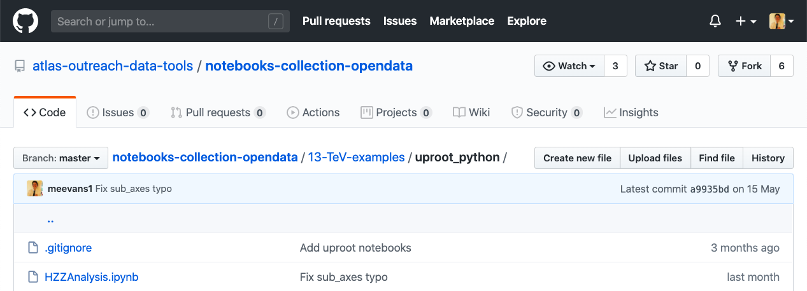
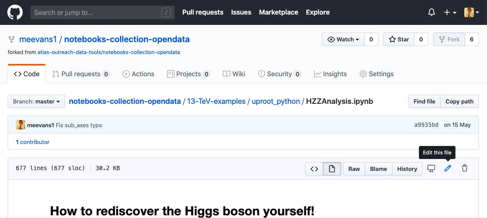
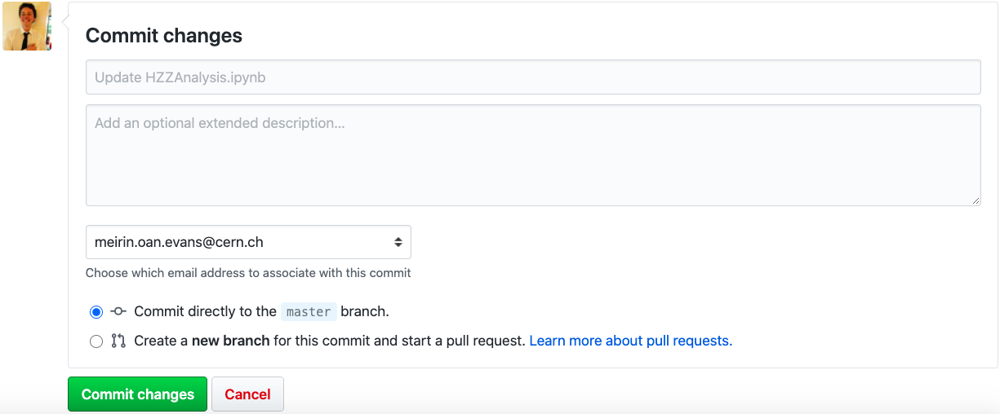
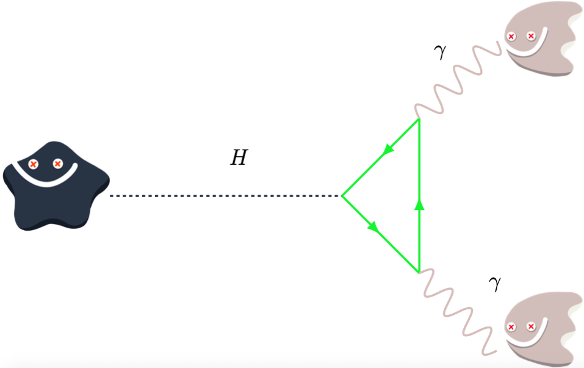

# How-to-rediscover-the-Higgs 
## Jupyter notebook with steps to rediscover the Higgs boson yourself!
------

## Get Started (online)
Click on this link ---> 

Click on one of the files Analysis.ipynb

## Get Started (on your own laptop)
Click on this link to [download the code](https://github.com/atlas-outreach-data-tools/notebooks-collection-opendata/archive/master.zip)

Once downloaded, unzip the file.

Open a [Jupyter notebook](https://jupyter.org) using your favourite [Python](https://www.python.org) (3.6 or above) environment (ours is [Anaconda](https://www.anaconda.com/distribution/))

Navigate to Downloads/notebooks-collection-opendata/13-TeV-examples/uproot_python

Click on one of the files Analysis.ipynb

## Develop the code for your use case

[Create a GitHub account](https://github.com/join), if you don't have one already.

Click on "Fork" in the top right corner of [this screen](https://github.com/atlas-outreach-data-tools/notebooks-collection-opendata/tree/master/13-TeV-examples/uproot_python)

Click to navigate to the file you want to edit, e.g. 13-TeV-examples/uproot_python/HZZAnalysis.ipynb

Click on the pencil "Edit this file"

Make your desired change.

Click on the green "Commit changes" at the bottom of the edit page.

Point your students to your forked code (the webpage you're on right now), rather than the [ATLAS code](https://github.com/atlas-outreach-data-tools/notebooks-collection-opendata/tree/master/13-TeV-examples/uproot_python)  

